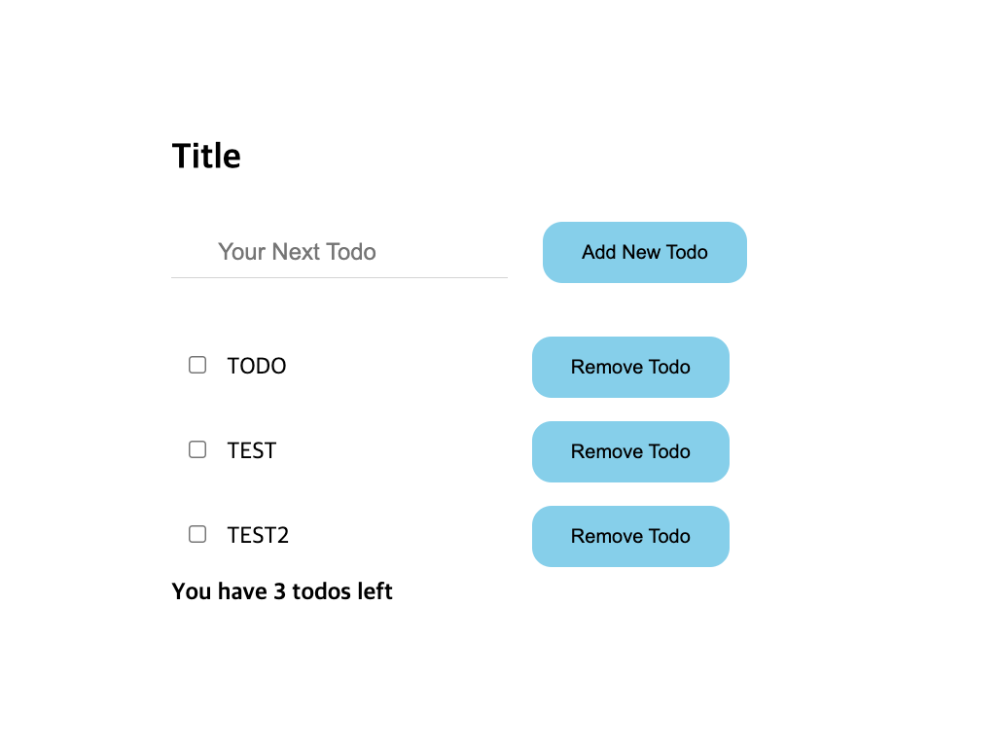
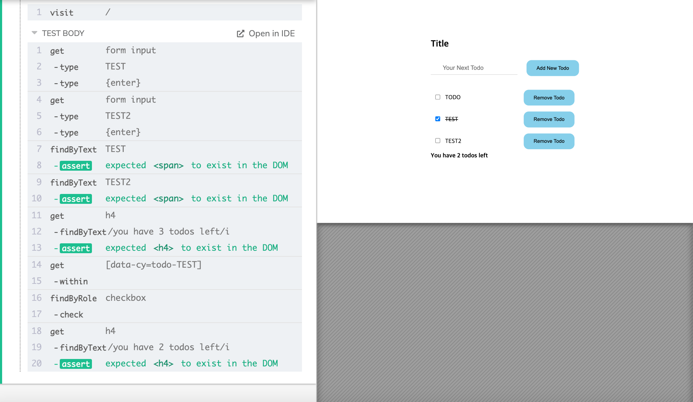

## Outline

> This Repo is for Tutorial of the Cypress Testing library

 
 

## Folder Structure

# cypress

- [fixtures/](./cypress/fixtures)
  - [example.json](./cypress/fixtures/example.json)
- [integration/](./cypress/integration) &nbsp; : _실제 테스트를 작성하기 위한 디렉토리_ 
  - [1-getting-started/](./cypress/integration/1-getting-started)
    - [todo.spec.js](./cypress/integration/1-getting-started/todo.spec.js)
  - [myTodo/](./cypress/integration/myTodo) &nbsp;&nbsp; : App에서 작성한 simple Todo App에 대한 테스트 작성
    - [todo.spec.js](./cypress/integration/myTodo/todo.spec.js)
- [plugins/](./cypress/plugins)
  - [index.js](./cypress/plugins/index.js)
- [support/](./cypress/support) &nbsp; : Cypress외의 다른 테스팅 라이브러리 사용할 경우 사용,  &nbsp;&nbsp;&nbsp;&nbsp;&nbsp;&nbsp;&nbsp;&nbsp;&nbsp;&nbsp;&nbsp;&nbsp;&nbsp;&nbsp;&nbsp;&nbsp;&nbsp;&nbsp; 이번 튜토리얼에서는 @testing-library/cypress 라이브러리 추가해 사용 
  - [commands.js](./cypress/support/commands.js)
  - [index.js](./cypress/support/index.js)
- [.eslintrc.json](./cypress/.eslintrc.json)

 
 

# src

- [App.css](./src/App.css) &nbsp; : Todo App에 대한 스타일 
- [App.js](./src/App.js) &nbsp; : Todo App작성
- [index.css](./src/index.css)
- [index.js](./src/index.js)
- [reportWebVitals.js](./src/reportWebVitals.js)
- [setupTests.js](./src/setupTests.js)

 
 

# Test 과정 요약

## APP 동작 과정 시나리오

1. 초기값으로 {text: TODO}가 들어 있는 상황
2. 상단의 Input창에 새로운 할일을 추가 후 Enter 또는 추가 버튼 클릭 시 하단에 입력한 할일 추가
3. 할일 목록마다 Check버튼이 있으며 클릭시 toggle함수가 시행되어 선이 그어지고 맨 밑에 남은 할일목록 _(체크 안된 목록 갯수)_가 변경
4. 목록 우측의 삭제 버튼 클릭시 해당 목록이 아예 삭제

 
 

### Demo Image

  

 
 

## Test 결과

  

